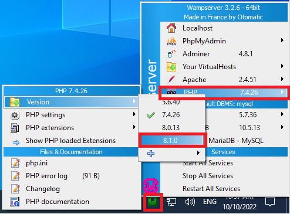
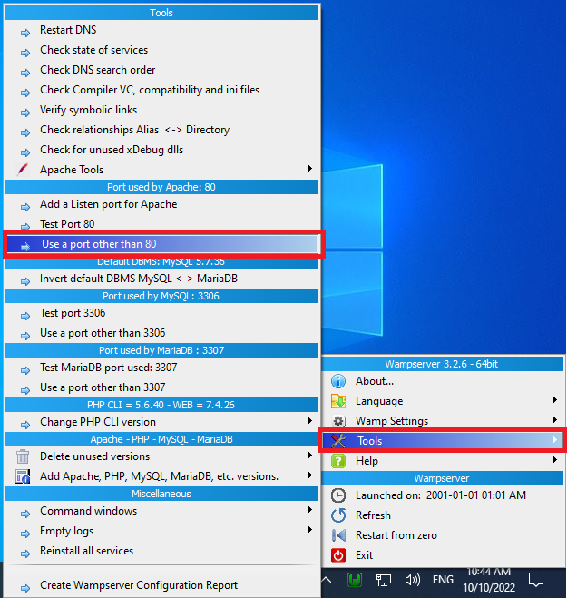

## Ecolla Snacks Store Online Listing Website

This website is created with [Laravel Framework](https://laravel.com/). Currently, the feature provided are:

- Item listing and ordering.
- Item and order management.
- Multiple variation for each item to list.
- Price discount settings for each variation with date range.
- Duo languages (English and Chinese) for user to switch.
- PDF download for orders.
- Free shipping feature.
- Account login for managing the item and order.
- Account permission managing for admin.

## Project Architecture

This project uses [PHP](https://www.php.net/) mainly and some [Javascript](https://www.javascript.com/). [Laravel](https://laravel.com) is used in this project.

<p align="center">
    <a href="https://laravel.com" target="_blank">
        
    </a>
</p>

## Project Information

This project is currently active and hosted 
[over here (listing page)](https://www.newrainbowmarket.com/) 
and [here (management page)](https://www.management.newrainbowmarket.com/). 
And also [beta site](https://www.beta.newrainbowmarket.com/).

### GitHub Commit

This project has total 4 repositories due to the way on demonstrating the project product, the repositories info:

- [EcollaLegacy](https://github.com/ahming2000/EcollaLegacy) (517 commits)
- [EcollaClient](https://github.com/ahming2000/EcollaClient) (246 commits)
- [EcollaManagement](https://github.com/ahming2000/EcollaManagement/tree/beta) (629 commits)
- [ecolla-snacks-store-web](https://github.com/ecolla-snacks-store/ecolla-snacks-store-web) (current repository)

More than 1400 commits for this project.

Due to subdomain policy, the idea come out last times was separating into two repositories. 
But this repository will merge them again and make many improvements. 

<hr>

## Project Setup

Software required to download (recommend to install in order with guideline below):

- [git](https://git-scm.com/downloads) (latest)
- [node.js](https://nodejs.org/en/) (v16 LTS)
- [WampServer](https://sourceforge.net/projects/wampserver/) (^3.2.6)
- [Composer](https://getcomposer.org/download/) (latest)

### WampServer Installation and Setup

#### Before Installing the Software

- Please install [Visual C++ Packages](https://www.techpowerup.com/download/visual-c-redistributable-runtime-package-all-in-one/) before install the WampServer!
- Please install the software with default path.

#### Version of Addon

> Please choose the correct version for installation!

- PHP v8.1.x
- MariaDB v10.5.x

<p align="center">
    
</p>

#### PHP Version

> You are required to change the version to v8.1.x manually.
> 
> **Left** click the wamp server icon.

<p align="center">
    
</p>

#### MariaDB Version

> Since default database is MySQL, you are required to change the default database and make sure the version is v10.5.x.
> 
> **Right** click the wamp server icon.

<p align="center">
    
</p>

### Composer Installation

> Please make sure to choose **PHP v8.1.x** as the command line version, this will auto add the php version to the environment variables.

<p align="center">
    
</p>

### Repository Setup

- Please clone the repository into `C:\wamp64\www` (default path).
- Create database named `ecolla_snacks_store_web` with [phpMyAdmin](http://localhost/phpmyadmin) console. Please make sure `utf8mb4_unicode_ci` is selected. **(Note that it uses `_` instead of `-`)**

<p align="center">
    
</p>

- Run the following script to set up the project:

```shell
npm run setup
```

In this script, several actions run:

- Install npm and composer packages.
- Generate local .env file.
- Create symbolic links for files uploading function.
- Migrate database tables and generate faker data

### Virtual Host Setup

> **Left** click the wamp server icon

<p align="center">
    
</p>

> Fill up virtual host name with `ecolla-snacks-store-web` and path with `C:\wamp64\www\ecolla-snacks-store-web\public` and start the creation.

<p align="center">
    
</p>

> Restart the DNS by **right** clicking the wamp server icon.

<p align="center">
    
</p>

### Issue With Port 80 Being Used

> You can change to desire port by **right-clicking** the wamp icon

<p align="center">
    
</p>

### Debugging

> Go http://ecolla-snacks-store-web/ and http://ecolla-snacks-store-web/management which created at [here](https://github.com/ecolla-snacks-store/ecolla-snacks-store-web#virtual-host-setup) for the page debugging.

<hr>

### Version Changing Log

> Please refer to [this link (EcollaManagement)](https://management.newrainbowmarket.com/changing-log) or [this link (current repository)](https://staging.newrainbowmarket.com/management/changing-log).

### Issue Reporting

> Feel free to report any issues or improvement for this project in [GitHub repository issue page](https://github.com/ecolla-snacks-store/ecolla-snacks-store-web/issues).
